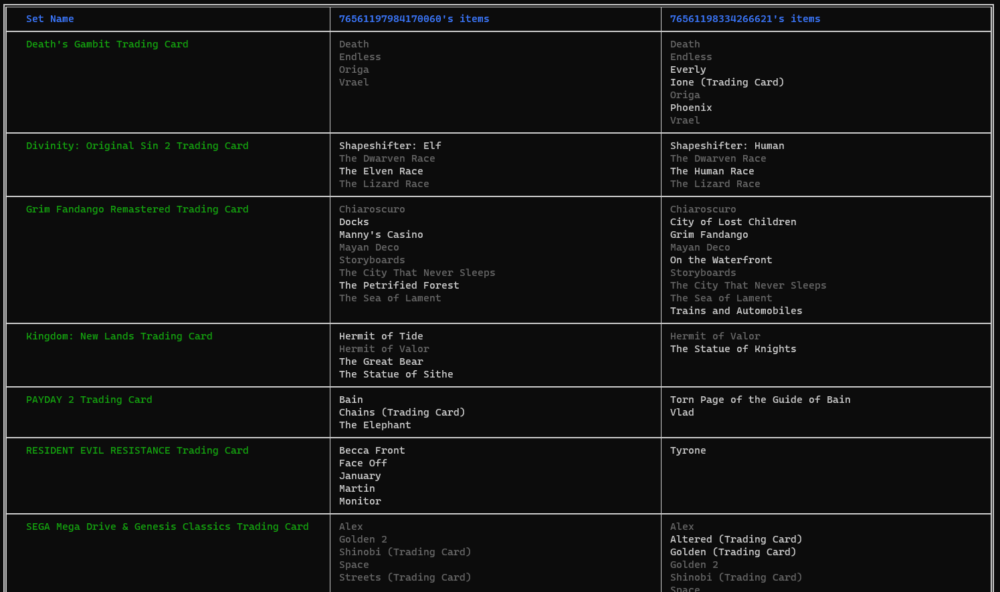

Script to find common trading sets between to Steam profiles. 

### Usage

Run using

    node findcommon.js 76561197984170060 76561197969177473

This script requires that both people have their inventory set to public. 

### Screenshot

Here's an example output

### Motivation
Sometimes I want to do a cross-set trade with another person on Steam.  It would help if I knew which sets are common between us, so that I can easily filter through their inventory without going through hundreds of pages.  

### TODO

- [ ] Make this a Docker container
- [ ] Show the items one per line within the cell
- [ ] Show the items alphabetically
